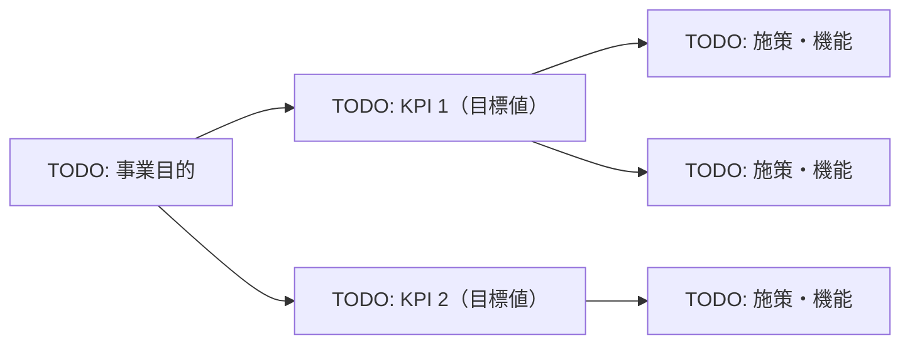

# ゴールツリー・KPIツリー

> 判断したいこと: 各機能はどの価値につながる？

```mermaid
flowchart LR
  G["TODO: 事業目的"] --> K1["TODO: KPI 1（目標値）"]
  G --> K2["TODO: KPI 2（目標値）"]
  K1 --> F1["TODO: 施策・機能"]
  K1 --> F2["TODO: 施策・機能"]
  K2 --> F3["TODO: 施策・機能"]
```

| 機能・施策 | つながる KPI | 貢献度 (高/中/低) | 根拠 |
|---|---|---|---|
| TODO | TODO | TODO | TODO |

貢献度が低い機能は、優先順位マトリクスやスコープ定義書で後回しの候補にする。
