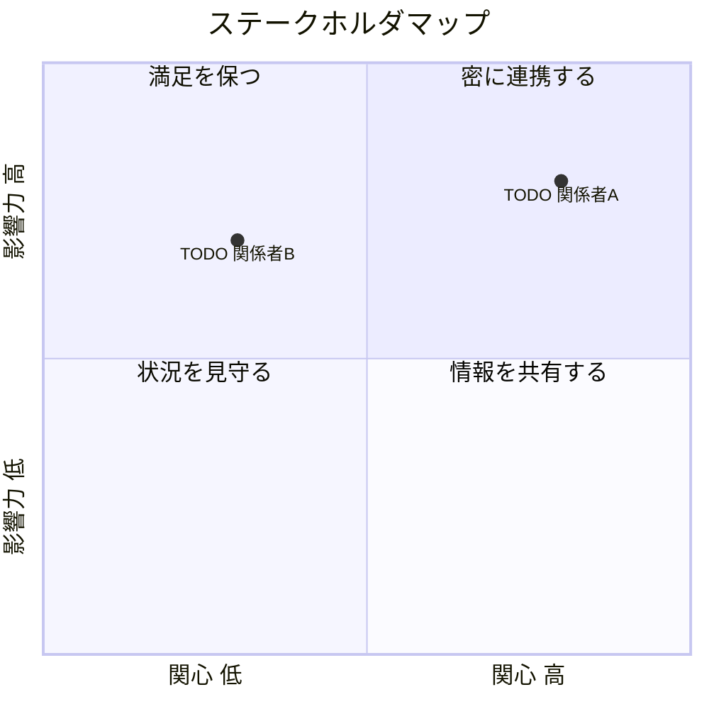

# ステークホルダマップ

> 判断したいこと: 誰の合意・意見・共有が必要？

```mermaid
quadrantChart
  title ステークホルダマップ
  x-axis "関心 低" --> "関心 高"
  y-axis "影響力 低" --> "影響力 高"
  quadrant-1 "密に連携する"
  quadrant-2 "満足を保つ"
  quadrant-3 "状況を見守る"
  quadrant-4 "情報を共有する"
  "TODO 関係者A": [0.8, 0.8]
  "TODO 関係者B": [0.3, 0.7]
```

| 関係者 | 影響力 | 関心 | 期待・懸念 | 関わり方 |
|---|---|---|---|---|
| TODO | 高/中/低 | 高/中/低 | TODO | 合意を取る / 意見を集める / 共有する |
