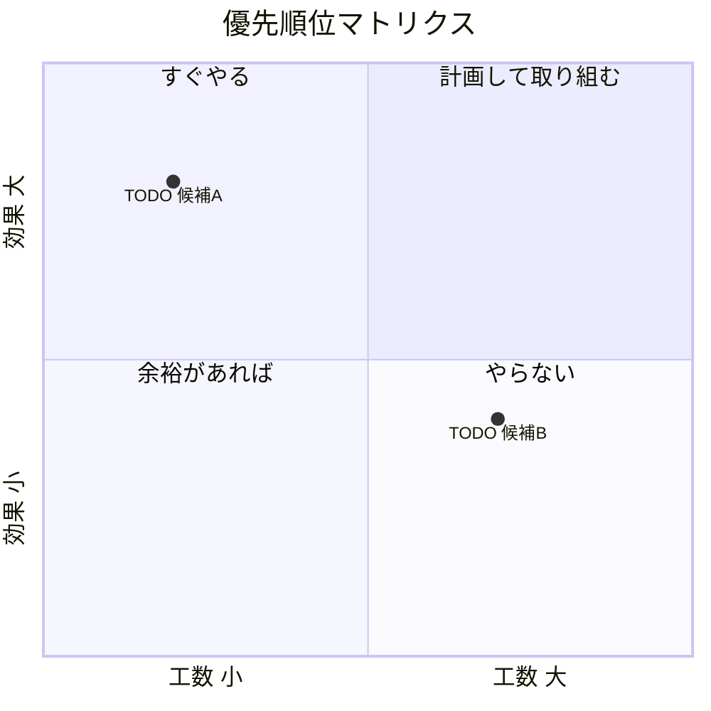

# 優先順位マトリクス

> 判断したいこと: どれから作るべき？

```mermaid
quadrantChart
  title 優先順位マトリクス
  x-axis "工数 小" --> "工数 大"
  y-axis "効果 小" --> "効果 大"
  quadrant-1 "計画して取り組む"
  quadrant-2 "すぐやる"
  quadrant-3 "余裕があれば"
  quadrant-4 "やらない"
  "TODO 候補A": [0.2, 0.8]
  "TODO 候補B": [0.7, 0.4]
```

| 候補 | 効果 (1-5) | 工数 (1-5) | 根拠 | 判断 |
|---|---|---|---|---|
| TODO | TODO | TODO | TODO: どの KPI・誰の要望か | すぐやる / 計画 / 保留 / やらない |
