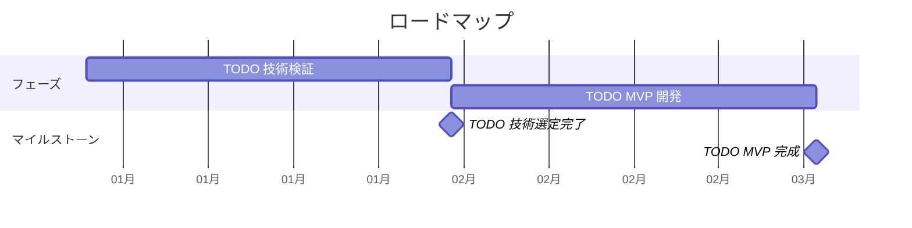

# プロジェクトロードマップ

> 判断したいこと: 大きな節目はいつ？

```mermaid
gantt
  title ロードマップ
  dateFormat YYYY-MM-DD
  axisFormat %m月
  section フェーズ
  TODO 技術検証 :p1, 2026-01-01, 30d
  TODO MVP 開発 :p2, after p1, 30d
  section マイルストーン
  TODO 技術選定完了 :milestone, m1, after p1, 0d
  TODO MVP 完成 :milestone, m2, after p2, 0d
```

| マイルストーン | 時期 | 完了の定義 |
|---|---|---|
| TODO | TODO | TODO |
