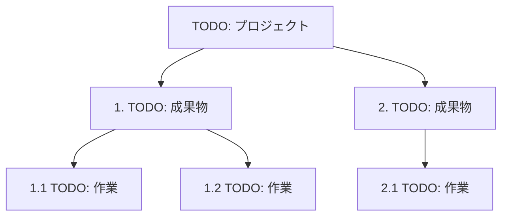

# WBS

> 判断したいこと: どんな作業が必要？

成果物を基準に、見積りと担当割当てができる大きさ（目安 1〜5 日）まで分解する。

```mermaid
flowchart TD
  P["TODO: プロジェクト"] --> D1["1. TODO: 成果物"]
  P --> D2["2. TODO: 成果物"]
  D1 --> W11["1.1 TODO: 作業"]
  D1 --> W12["1.2 TODO: 作業"]
  D2 --> W21["2.1 TODO: 作業"]
```

| WBS 番号 | 作業 | 完了条件 | 担当 |
|---|---|---|---|
| 1.1 | TODO | TODO | TODO |
