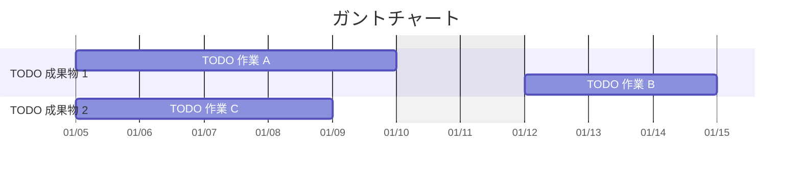

# ガントチャート

> 判断したいこと: いつ完成する？

```mermaid
gantt
  title ガントチャート
  dateFormat YYYY-MM-DD
  axisFormat %m/%d
  excludes weekends
  section TODO 成果物 1
  TODO 作業 A :a1, 2026-01-05, 5d
  TODO 作業 B :a2, after a1, 3d
  section TODO 成果物 2
  TODO 作業 C :b1, 2026-01-05, 4d
```

## 気づいたこと

- 重複・過負荷になっている期間: TODO
- 余裕（フロート）がある作業: TODO
