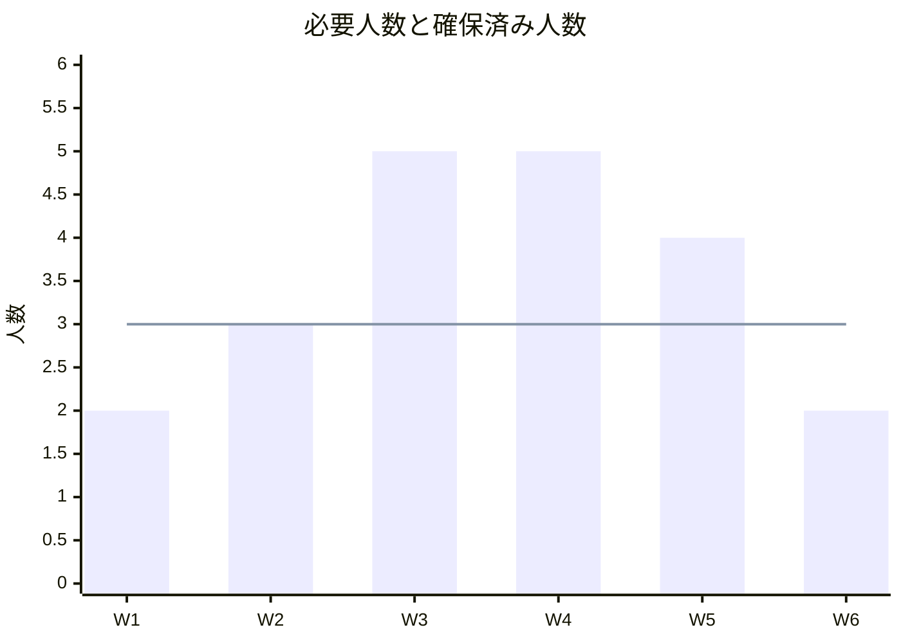

# リソースヒストグラム

> 判断したいこと: 人員は足りている？

```mermaid
xychart-beta
  title "必要人数と確保済み人数"
  x-axis [W1, W2, W3, W4, W5, W6]
  y-axis "人数" 0 --> 6
  bar [2, 3, 5, 5, 4, 2]
  line [3, 3, 3, 3, 3, 3]
```

棒が必要人数、線が確保済み人数（TODO: 実際の値に置き換える）。

| 期間 | 必要 | 確保済み | 不足 | 対策 |
|---|---|---|---|---|
| TODO | TODO | TODO | TODO | 作業時期の変更 / 増員 / 担当変更 |
