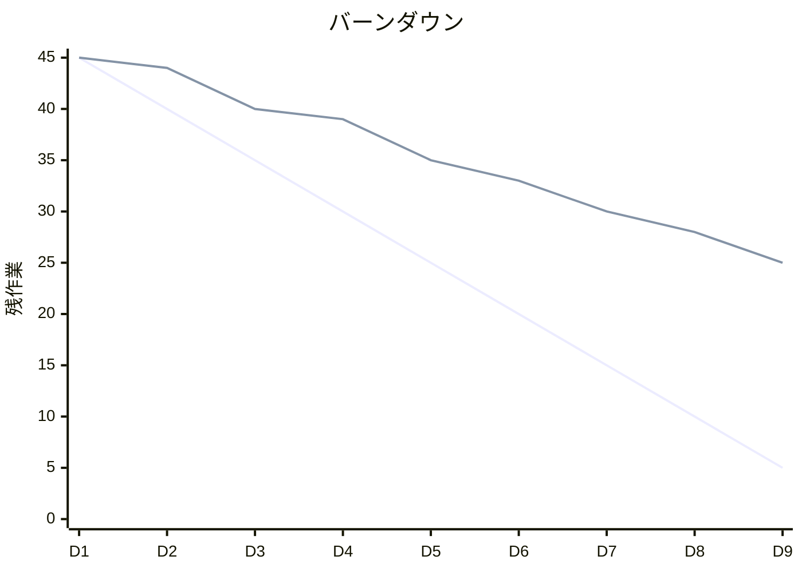

# バーンダウンチャート

> 判断したいこと: このペースで期限に間に合う？

```mermaid
xychart-beta
  title "バーンダウン"
  x-axis [D1, D2, D3, D4, D5, D6, D7, D8, D9]
  y-axis "残作業" 0 --> 45
  line [45, 40, 35, 30, 25, 20, 15, 10, 5]
  line [45, 44, 40, 39, 35, 33, 30, 28, 25]
```

1 本目が理想線、2 本目が実績（TODO: 実際の値に置き換える）。単位: TODO（ストーリーポイント / タスク数）

## 判断

- 今のペースでの完了見込み: TODO
- 調整案（スコープを減らす / 期間を延ばす / 人を足す）: TODO
