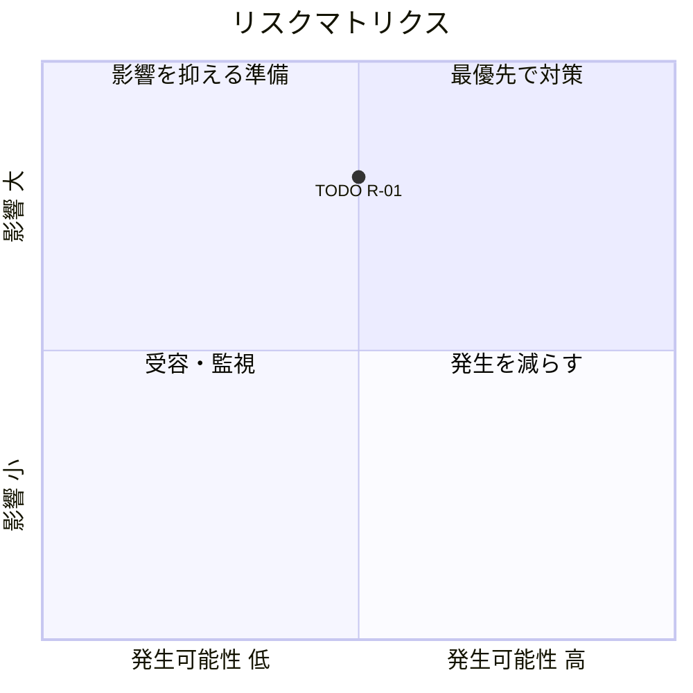

# リスクマトリクス

> 判断したいこと: どのリスクに優先して手を打つ？

リスク登録簿の各リスクを発生可能性 × 影響に置く（0〜1 に換算: 低 0.2 / 中 0.5 / 高 0.8）。

```mermaid
quadrantChart
  title リスクマトリクス
  x-axis "発生可能性 低" --> "発生可能性 高"
  y-axis "影響 小" --> "影響 大"
  quadrant-1 "最優先で対策"
  quadrant-2 "影響を抑える準備"
  quadrant-3 "受容・監視"
  quadrant-4 "発生を減らす"
  "TODO R-01": [0.5, 0.8]
```

## 優先して手を打つリスク

- TODO
