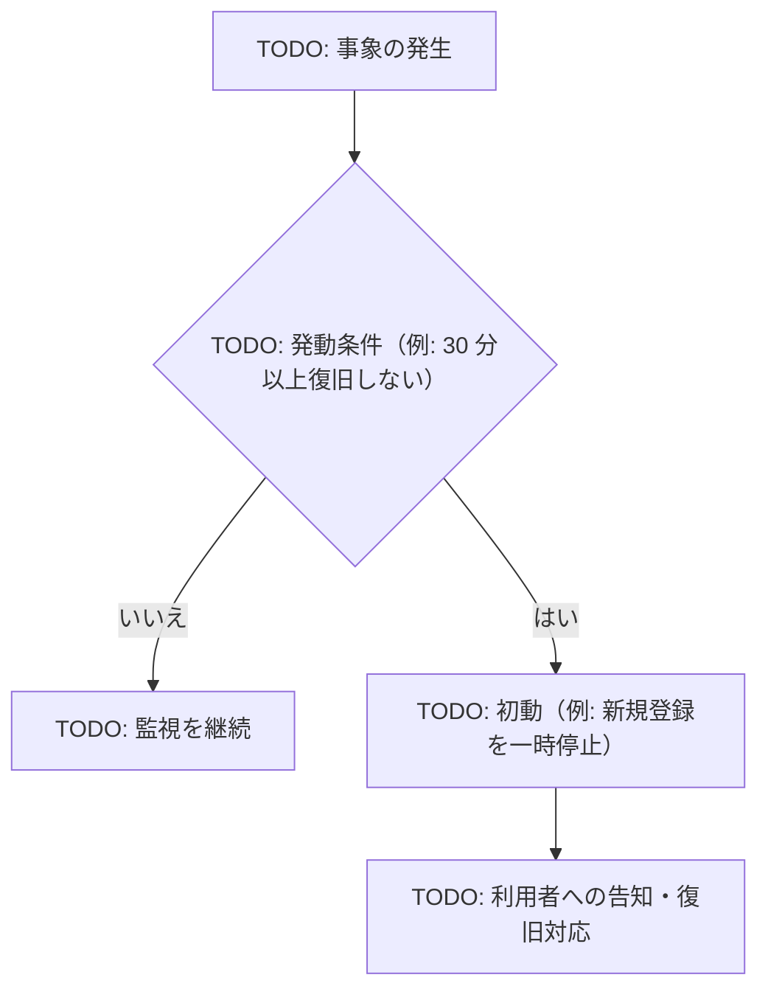

# コンティンジェンシー計画

> 判断したいこと: 起きたらどう動く？

## 対象リスク

TODO: 例: 外部認証 API の障害

```mermaid
flowchart TD
  E["TODO: 事象の発生"] --> Q{"TODO: 発動条件（例: 30 分以上復旧しない）"}
  Q -- いいえ --> W["TODO: 監視を継続"]
  Q -- はい --> A1["TODO: 初動（例: 新規登録を一時停止）"]
  A1 --> A2["TODO: 利用者への告知・復旧対応"]
```

| 項目 | 内容 |
|---|---|
| 発動条件 | TODO |
| 判断者 | TODO |
| 必要なリソース | TODO |
| 連絡先 | TODO |
| 解除条件 | TODO |
