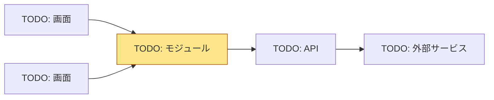

# 依存関係図・影響範囲図

> 判断したいこと: 変更はどこまで波及する？

矢印は「依存する側 → 依存される側」。変更対象から矢印を逆にたどったものが影響範囲。

```mermaid
flowchart LR
  S1["TODO: 画面"] --> M1["TODO: モジュール"]
  S2["TODO: 画面"] --> M1
  M1 --> API1["TODO: API"]
  API1 --> EXT["TODO: 外部サービス"]
  classDef changed fill:#fde68a,stroke:#b45309
  class M1 changed
```

## 影響範囲

| 対象 | 直接 / 間接 | 必要な対応（修正・回帰テスト・連絡） |
|---|---|---|
| TODO | TODO | TODO |
