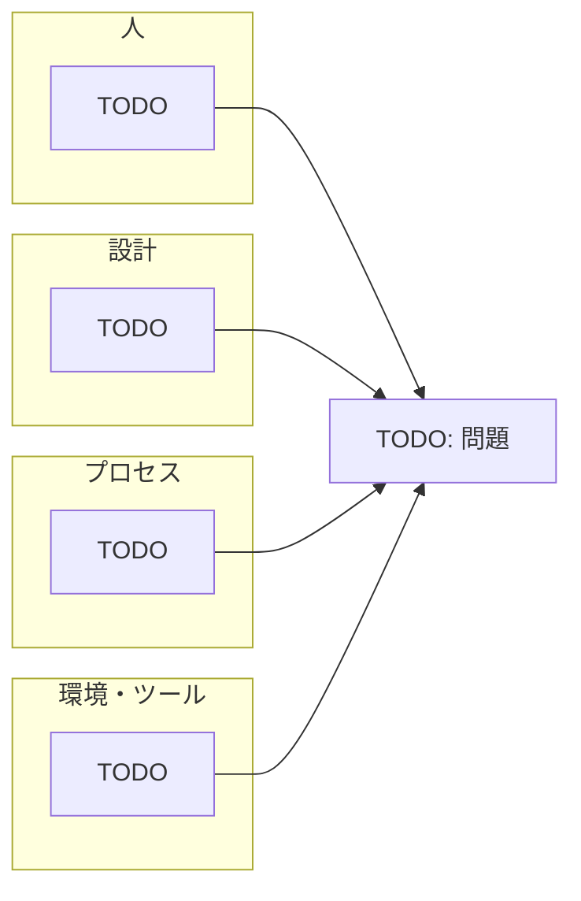

# 特性要因図

> 判断したいこと: なぜ問題が発生した？

## 問題

TODO: 起きている症状（例: リリース後のクラッシュ増加）

```mermaid
flowchart LR
  subgraph G1["人"]
    P1["TODO"]
  end
  subgraph G2["設計"]
    D1["TODO"]
  end
  subgraph G3["プロセス"]
    R1["TODO"]
  end
  subgraph G4["環境・ツール"]
    E1["TODO"]
  end
  P1 --> X["TODO: 問題"]
  D1 --> X
  R1 --> X
  E1 --> X
```

## 根本原因と対策

| 原因 | 根拠（データ・事実） | 対策 |
|---|---|---|
| TODO | TODO | TODO |

個人のミスで終わらせず、仕組みで防げる原因まで掘る。
