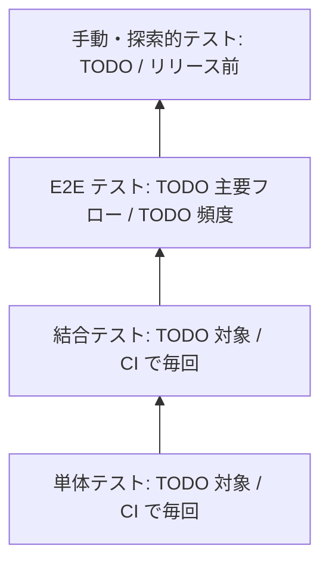

# テスト戦略図

> 判断したいこと: どのテストに投資する？

```mermaid
flowchart BT
  U["単体テスト: TODO 対象 / CI で毎回"] --> I["結合テスト: TODO 対象 / CI で毎回"]
  I --> E["E2E テスト: TODO 主要フロー / TODO 頻度"]
  E --> M["手動・探索的テスト: TODO / リリース前"]
```

| テスト種別 | 対象 | 責任者 | タイミング | ツール |
|---|---|---|---|---|
| TODO | TODO | TODO | TODO | TODO |

## 方針

- 品質リスクが高く重点的に検証する領域: TODO
- あえて自動化しないもの: TODO
