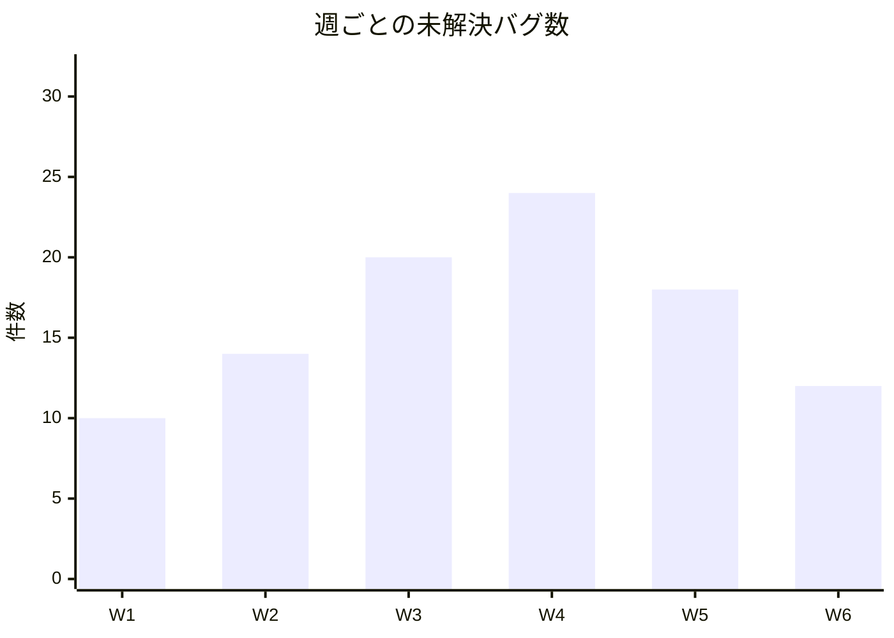

# 品質ダッシュボード

> 判断したいこと: 品質は十分？

| 指標 | 現在値 | 目標 | 状態 |
|---|---|---|---|
| TODO | TODO | TODO | 達成 / 未達 |

```mermaid
xychart-beta
  title "週ごとの未解決バグ数"
  x-axis [W1, W2, W3, W4, W5, W6]
  y-axis "件数" 0 --> 32
  bar [10, 14, 20, 24, 18, 12]
```

（TODO: 実際の値に置き換える）

## 判断

- 悪化している指標と対応: TODO
