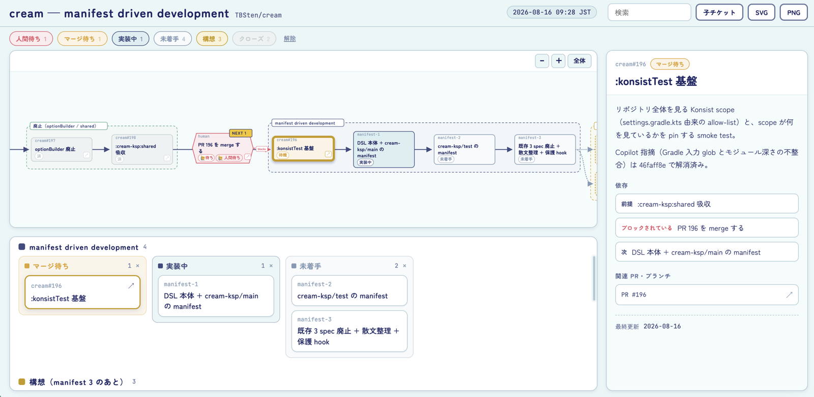

# status-board

**Collapse everything you have in flight into a single HTML page.** A dependency-graph SVG plus an
epic-by-epic kanban, built so that "what is waiting on me" and "what is next" read at a glance.



Reading the example above:

- **Graph (top)** — dependencies flow left to right. Dashed frames are epics; a red hexagon is
  blocked on a human, and the gold `NEXT 1` marks the next move. **Open decisions sit directly
  beneath whatever they hold up, with a dashed red arrow pushing up into it** — far easier to read
  than a long edge sweeping across the whole graph
- **Kanban (bottom)** — one band per epic, showing only the status columns that band actually has
- **Detail panel (right)** — body, dependencies (prerequisite / blocked-by / next), and linked PRs
  for the current selection
- **Filter row (top)** — status chips; pressing one dims the graph and removes the column from the kanban

## Install

```sh
gh skill install tbsten/skills status-board
```

## Overview

Collects GitHub PRs and issues, local branches, and — crucially — **the open questions and
human-blocked items that only exist in the conversation**, then writes a **standalone single file**
to `.local/status-board/<yyyy-MM-dd-HH-mm>.html`. CSS and JS are inlined, so it just opens in a browser.

Drag to pan and wheel to zoom; zooming out triggers **semantic zoom**, dropping detail lines so the
whole chain stays readable. Clicking an epic label folds that group into a single node and reroutes
its dependency edges. The graph alone can be exported as SVG or PNG — and Shift-clicking several
tickets exports **a view with only those lifted out of the rest** (see below).

Two things are designed to be unmissable: the 🙋 hexagon (waiting on a human) and the gold
`NEXT n` flag (the next move).

## When to use it

- Several PRs or work streams are in flight and you need to see **what is stuck**
- You want to see where a stack of PRs is blocked
- You want an overview of what is left in an ongoing migration
- You want to **hand a batch of questions to the user** (see below)
- You need one page to show someone the current state

## Ask boxes — collect answers in the browser

Items with an `ask` field, and anything marked as waiting on a human, render two textareas in the
detail panel: the question and the answer.

- Once an answer is written, the graph chip flips from `🙋 人間待ち` to `✓ 回答済` and the kanban
  card gets a green ✓
- Content is stored in `localStorage`, keyed by **board name + item id**, so **answers carry over to
  the next generated file** as long as the id is stable
- Some browsers disable `localStorage` for `file://` URLs. To keep answers, open the page through
  the bundled `serve.mjs`

## Multi-select — build the figure you paste into a PR

**Shift-click to select several tickets.** It works the same in the graph and in the kanban; a plain
click still selects exactly one.

- While more than one is selected, the detail panel becomes **a list of the selection**. Clicking a
  row drills into that single ticket; ✕ drops it from the selection
- With a selection active, `SVG` / `PNG` exports **the whole graph with only the selected tickets
  lifted out**: everything else sinks to a faint wash, and only edges whose *both* endpoints are
  selected stay bold

Pasting the entire graph leaves the reader guessing which part you mean. Select the few tickets that
matter and the exported figure **drops straight into a PR or issue description**. It keeps the full
graph rather than cropping so the reader still sees where those tickets sit in the whole.

Selection lights **only the selected nodes** — it does not walk the dependency edges to light the
whole connected component, because in a single-file stack that would light everything from one click
and there would be nothing left to narrow down.

## Built for speed

Perceived speed is treated as part of the spec: **the user gets the HTML within 5 turns and under a
minute**, with verification pushed to the background rather than making them wait.

| Mechanism | Why it matters |
| --- | --- |
| `collect.mjs` uses **one GraphQL round trip** | Querying `gh` per PR scales with PR count; one round trip is ~1 second |
| Defaults filled in for `epics` / `next` / `col` / `status` | The agent does not deliberate over layout up front |
| **Overlay** files for deltas | No rewriting a multi-KB JSON — just add the 10–20 lines that are new |
| **`__verify()` shipped inside the output** | Verification is a single `browser_evaluate`; no check scripts to assemble |
| Runtime errors buffered in the page | No separate round trip to read the console |
| Error messages state **how to fix it** | The agent applies the fix instead of reasoning it out |

## What it produces

Exactly one file: `.local/status-board/<yyyy-MM-dd-HH-mm>.html`. Intermediates stay in a scratch
directory. The only external reference is a Google Fonts `<link>`; offline it falls back cleanly.

## Bundled resources

| Path | Role |
| --- | --- |
| `scripts/collect.mjs` | Builds a draft `board.json` from GitHub and git, keeping raw output out of the agent's context |
| `scripts/build-board.mjs` | Validates `board.json` (+ overlay), injects it into the template, writes the single file |
| `scripts/serve.mjs` | Static server for verification — Playwright MCP cannot open `file://` |
| `assets/board-template.html` | The output template; identical to the output apart from the data block |
| `references/data-schema.md` | `board.json` / `overlay.json` format and validation rules |
| `references/review-checklist.md` | Verification procedure and what `__verify()` covers |

## Project assumptions

- A git repository. If it is on GitHub, PRs and issues are picked up too
- **No assumptions about language or framework**

## Requirements

- `node` (any version with ESM)
- `git`
- Optional: `gh` (GitHub CLI, authenticated). Without it, the board is built from local git only
- Optional: Playwright MCP. Without it verification is skipped and reported as skipped
- Add the output directory (`.local/`) to `.gitignore` to keep the working tree clean — the skill
  checks this at startup and offers to add it

## Limitations

- Google Fonts are not embedded in SVG / PNG exports; without the font installed they fall back
- The graph is a dependency graph only; no other chart types
- Dependency edges must run left lane → right lane. Same-lane and reversed edges are rejected
  because the routing breaks
- No merge with previous runs — every run regenerates from scratch (ask-box answers survive via
  `localStorage`)
